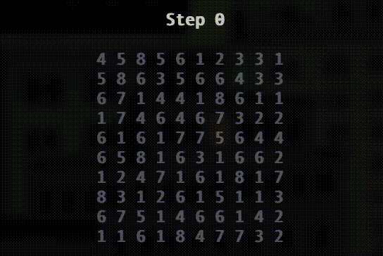

# Advent Of Code 2021

To run all day 1 - 25:

```
npm run all
```

To run a specific day, for example day 1:

```
npm run day1
```

## Day 11 - Dumbo Octopus



## Day 18: Snailfish

Interesting tree problem.
> To reduce a snailfish number, you must repeatedly do the first action in this list that applies to the snailfish number:
>
> - If any pair is nested inside four pairs, the leftmost such pair explodes.
> - If any regular number is 10 or greater, the leftmost such regular number splits.
>
> To explode a pair, the pair's left value is added to the first regular number to the left of the exploding pair (if any), and the pair's right value is added to the first regular number to the right of the exploding pair (if any). Exploding pairs will always consist of two regular numbers. Then, the entire exploding pair is replaced with the regular number 0.
>
> To split a regular number, replace it with a pair; the left element of the pair should be the regular number divided by two and rounded down, while the right element of the pair should be the regular number divided by two and rounded up. For example, 10 becomes [5,5], 11 becomes [5,6], 12 becomes [6,6], and so on.

## Day 19: Beacon Scanner

Good problem about [Affine transformation](https://en.wikipedia.org/wiki/Affine_transformation).

# Day 21: Dirac Dice

Dynamic programming problem.

# Day 22: Reactor Reboot

Divide and conquer problem.
