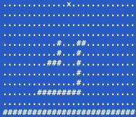
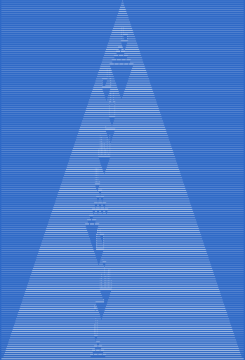

# Advent Of Code 2022

To run all days:

```
cargo run
```

To test for all days:

```
cargo test
```

To run tests for a specific day. For example, for day 10:

```
cargo test day10
```

To run tests with print output:

```
cargo test day10 -- --nocapture
```

To run a specific day, with animation (usually). For example, for day 14:

```
cargo run -- day14
```

## Day 7: No Space Left On Device

`RefCell<T>` and the Interior Mutability Pattern 
https://doc.rust-lang.org/book/ch15-05-interior-mutability.html

## Day 10: Cathode-Ray Tube

```
###..#....####.####.####.#.....##..####.
#..#.#....#.......#.#....#....#..#.#....
#..#.#....###....#..###..#....#....###..
###..#....#.....#...#....#....#.##.#....
#.#..#....#....#....#....#....#..#.#....
#..#.####.####.####.#....####..###.####.
```

## Day 13: Day 13: Distress Signal

https://doc.rust-lang.org/std/cmp/trait.Ord.html

## Day 14: Regolith Reservoir

```
$ cargo run -- day14
```





## Day 16: Proboscidea Volcanium

https://www.reddit.com/r/adventofcode/comments/zn6k1l/2022_day_16_solutions/

Heavily inspired by discussion in reddit.

Without much optimization, solved with back-tracing and Floyd-Warshall algorithm, in about 45 seconds. 
