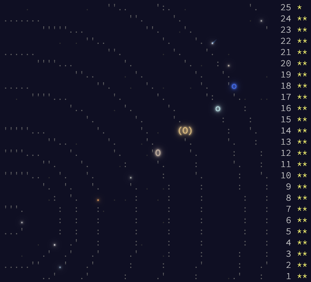
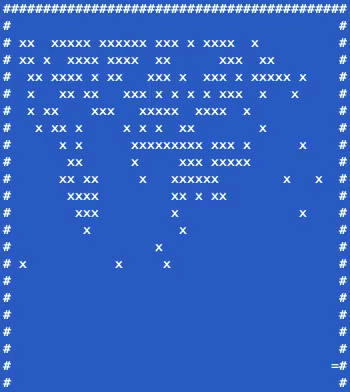
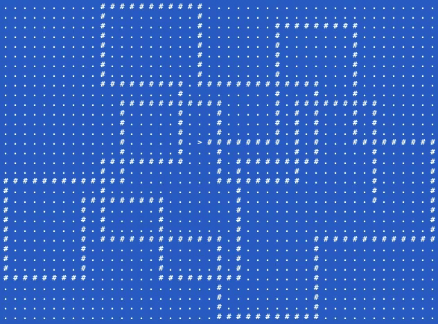
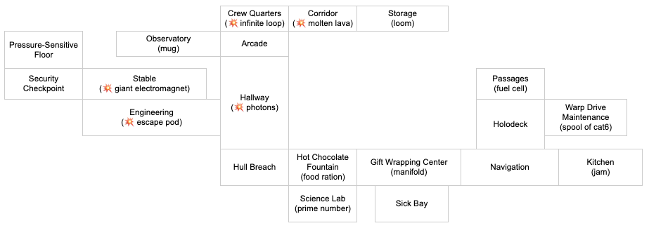

# AdventOfCode

[Advent of Code 2019](https://adventofcode.com/2019/) in Rust. Compile and run the code with:

```
cargo run
```



Some interesting challenges highlighted below.

## Day 8: Space Image Format

Find the BIOS password that is encoded in a special Space Image Format.

```
#           # #     #       # #     #   # # #     
#         #     #   #       # #     #   #     #   
#         #           #   #   # # # #   # # #     
#         #   # #       #     #     #   #     #   
#         #     #       #     #     #   #     #   
# # # #     # # #       #     #     #   # # #     
```

## Day 11: Painting Robot

A registration identifier painted the "emergency hull painting robot".

```
    *        *     *  *  *  *        *  *        *  *  *  *     *        *     *  *  *        *              *  *  *             
    *        *              *     *        *     *              *     *        *        *     *              *        *          
    *        *           *        *        *     *  *  *        *  *           *  *  *        *              *        *          
    *        *        *           *  *  *  *     *              *     *        *        *     *              *  *  *             
    *        *     *              *        *     *              *     *        *        *     *              *                   
       *  *        *  *  *  *     *        *     *  *  *  *     *        *     *  *  *        *  *  *  *     *                   
```

## Day 13: Care Package

Most visual and fun puzzle of the year.

 

## Day 15: Oxygen System

 


## Day 16: Flawed Frequency Transmission

All my endless hours of reading about [Fourier transform](https://en.wikipedia.org/wiki/Fourier_transform), [Fast Fourier transform](https://en.wikipedia.org/wiki/Fast_Fourier_transform), [Discrete Fourier transform](https://en.wikipedia.org/wiki/Discrete_Fourier_transform), all truns out to be useless. The challenging is a word puzzle and a cumulative sum. 

In memory of my favourite explanation of Fourier Transformation on [Youtube by 3Blue1Brown](https://www.youtube.com/watch?v=spUNpyF58BY), and most mind-blowing image processing course [CS9630a by Prof. John Barron](http://www.csd.uwo.ca/courses/CS9630a/).

```
 1  0 -1  0  1  0 -1  0  1  0 -1  0  1  0 -1  0 
 0  1  1  0  0 -1 -1  0  0  1  1  0  0 -1 -1  0 
 0  0  1  1  1  0  0  0 -1 -1 -1  0  0  0  1  1 
 0  0  0  1  1  1  1  0  0  0  0 -1 -1 -1 -1  0 
 0  0  0  0  1  1  1  1  1  0  0  0  0  0 -1 -1 
 0  0  0  0  0  1  1  1  1  1  1  0  0  0  0  0 
 0  0  0  0  0  0  1  1  1  1  1  1  1  0  0  0 
 0  0  0  0  0  0  0  1  1  1  1  1  1  1  1  0 
 0  0  0  0  0  0  0  0  1  1  1  1  1  1  1  1 
 0  0  0  0  0  0  0  0  0  1  1  1  1  1  1  1 
 0  0  0  0  0  0  0  0  0  0  1  1  1  1  1  1 
 0  0  0  0  0  0  0  0  0  0  0  1  1  1  1  1 
 0  0  0  0  0  0  0  0  0  0  0  0  1  1  1  1 
 0  0  0  0  0  0  0  0  0  0  0  0  0  1  1  1 
 0  0  0  0  0  0  0  0  0  0  0  0  0  0  1  1 
 0  0  0  0  0  0  0  0  0  0  0  0  0  0  0  1
```


## Day 17: Set and Forget

 

## Day 21: Springdroid Adventure

All about logic gates. 

``` 
......@..........       ....@...@...@....
.....@.@.........       ...@.@.@.@.@.@...
....@...@........       ..@...@...@...@..
#####.###########       #####.##.##..####

.....@...@.......       ....@....@.......
....@.@.@.@......       ...@.@..@.@......
...@...@...@.....       .@@...@@...@.....
#####.?#.########       #####.###..#.####

....@...@........       ......@...@......
...@.@.@.@.......       .....@.@.@.@.....
..@...@...@......       ...@@...@...@....
#####.#..########       #####.#.##.######
```

## Day 22: Slam Shuffle

A solution that requires 1.9TB of memory and 29 years of run time.
And an opportunity for you to become a modular arithmetic expert overnight. 

## Day 23: Category Six

Let's try multi threading in rust. 

[#fearless-concurrency](https://doc.rust-lang.org/book/ch16-00-concurrency.html#fearless-concurrency)

## Day 25: Cryostasis

Map for Santa's ship.



> As you move through the main airlock, the air inside the ship is already heating up to reasonable levels. Santa explains that he didn't notice you coming because he was just taking a quick nap. The ship wasn't frozen; he just had the thermostat set to "North Pole". 
> 
> You make your way over to the navigation console. It beeps. "Status: Stranded. Please supply measurements from 49 stars to recalibrate." 
> 
> "49 stars? But the Elves told me you needed fifty--" 
> 
> Santa just smiles and nods his head toward the window. There, in the distance, you can see the center of the Solar System: the Sun! ☀️
> 
> The navigation console beeps again. 
